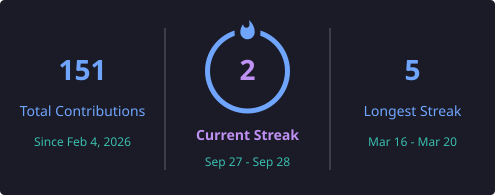

##  #<i>Intro</i> :-
## Hi, I'm V. Aryan Kabir

***Web & Software Developer | AI/ML • Embedded Systems • Robotics***

I enjoy turning ideas into practical software, intelligent systems, and interactive web experiences.

I work mainly around modern Web & Software development, Personal AI assistant, AI-assisted software, embedded systems, and experimental engineering projects. I like building things that are useful, well-designed, and actually work.

###  Currently Working On

- Building modern web applications and software projects
- Exploring AI/ML and intelligent assistant systems
- Working on Personal Assistant Programme

### 🌐 Portfolio

**[v-aryankabir.vercel.app](https://v-aryankabir.vercel.app)**

---

## 📊 GitHub Stats

| GitHub Stats |
| --- |
|  |

| Current Streak | Most Used Languages |
| --- | --- |
|  |  |

---

## | Skills & Technologies

**Programming:**  

**Development:**  

**AI, Embedded & Engineering:**  

**Tools & Platforms:**  

---

## | Connect With Me

---

  
